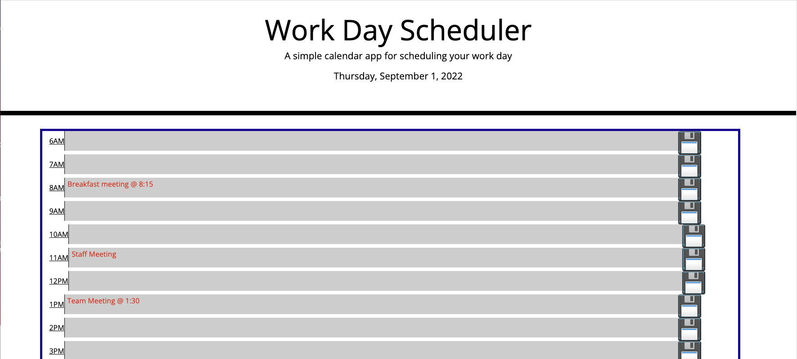
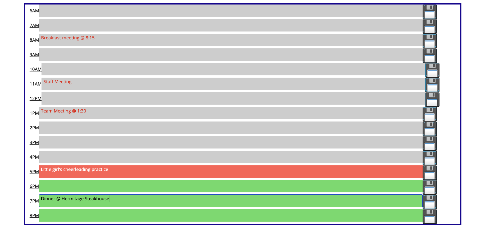

# Daily_Planner_Project_via_Javascript-Jquery

## Deployed Application
[Brad's Daily Planner via Javascript and Jquery](https://brad-hambrick.github.io/Daily_Planner_Project_via_Javascript-Jquery/)

## Description
This project was completed in order to showcase javascript and Jquery skills and provide a simple daily planner to assist with organizing a busy schedule.

## Badges
There are no images that require licensing and all the coding methods were those taught in the Vanderbilt Web Development Boot Camp.

## Visuals

## Usage
This project will be used to showcase javascript and Jquery skills as well as be used to organize a busy day to day schedule in the life of a full time employee, father, as well as a coding student at night.

## Support
For support, contact Brad Hambrick @bradleyhambrick@gmail.com

## Roadmap
This project is still in the very early phases and will be getting several alterations and improvements.  

## Contributing
This project is open to recommendations and future contributions.

## Authors and acknowledgment
Thanks to Vanderbilt Coding Bootcamp for contributing to the knowledge required to build this project.

## License
N/A 

## Project status
The project is still in the early phases and still requires improvements.    